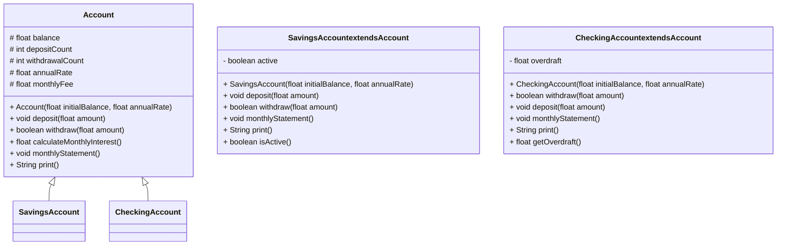

# Bank Account - Inheritance

## Diagram

```mermaid
classDiagram
    class Account {
  # float balance
  # int depositCount
  # int withdrawalCount
  # float annualRate
  # float monthlyFee
  + Account(float initialBalance, float annualRate)
  + void deposit(float amount)
  + boolean withdraw(float amount)
  + float calculateMonthlyInterest()
  + void monthlyStatement()
  + String print()
}

class SavingsAccount extends Account {
  - boolean active
  + SavingsAccount(float initialBalance, float annualRate)
  + void deposit(float amount)
  + boolean withdraw(float amount)
  + void monthlyStatement()
  + String print()
  + boolean isActive()
}

class CheckingAccount extends Account {
  - float overdraft
  + CheckingAccount(float initialBalance, float annualRate)
  + boolean withdraw(float amount)
  + void deposit(float amount)
  + void monthlyStatement()
  + String print()
  + float getOverdraft()
}

Account <|-- SavingsAccount
Account <|-- CheckingAccount
```
