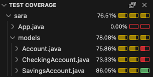

# Bank Account - Inheritance
This project implements a Java program that models different types of bank accounts: Account, SavingsAccount, and CheckingAccount. It allows managing deposits, withdrawals, interest calculation, and generating monthly statements.

The program simulates basic banking operations with specific rules depending on the account type:

- **Account (base class)**: Manages balance, number of deposits and withdrawals, annual interest rate, and monthly commission.
- **SavingsAccount**: Allows operations only if active (balance ≥ 10,000), applies fees for extra withdrawals, and tracks account activity.
- **CheckingAccount**: Allows overdraft, letting withdrawals exceed balance, with overdraft managed by future deposits.

## 📈 Diagram

## 🧪 Test

